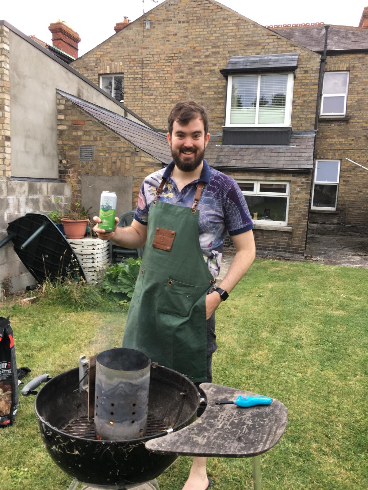

My name is Mike, I am a software engineer living in Ireland working for a well known Silcon Valley tech company. 

In my spare time I love to cook. Especially on charcoal fires. I was born and raised in South Africa and while I have not lived there in a long time the spirit of braaing has lived on in me. I love to braai. 

I try new recipes all the time and sometimes I can't remember where I found a recipe or what I thought about something when it was cooked. So I bought this domain to blog about what I am cooking, where I found the recipe and what it was like. 

I am also building this website using alot of cool current technologies for building websites so I will be keeping a log about how I built this for people who are interested as well. 

Enjoy!