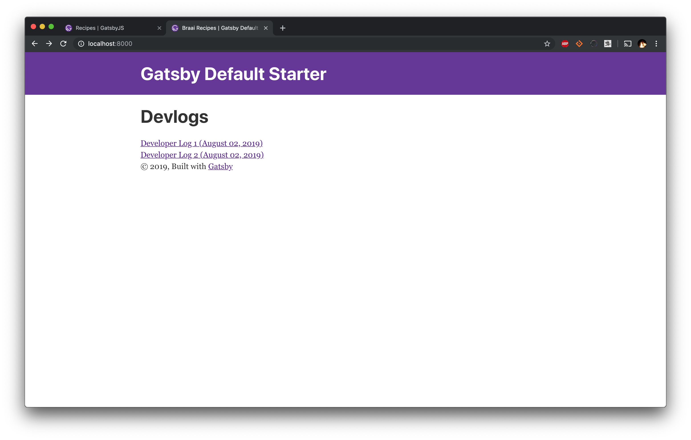
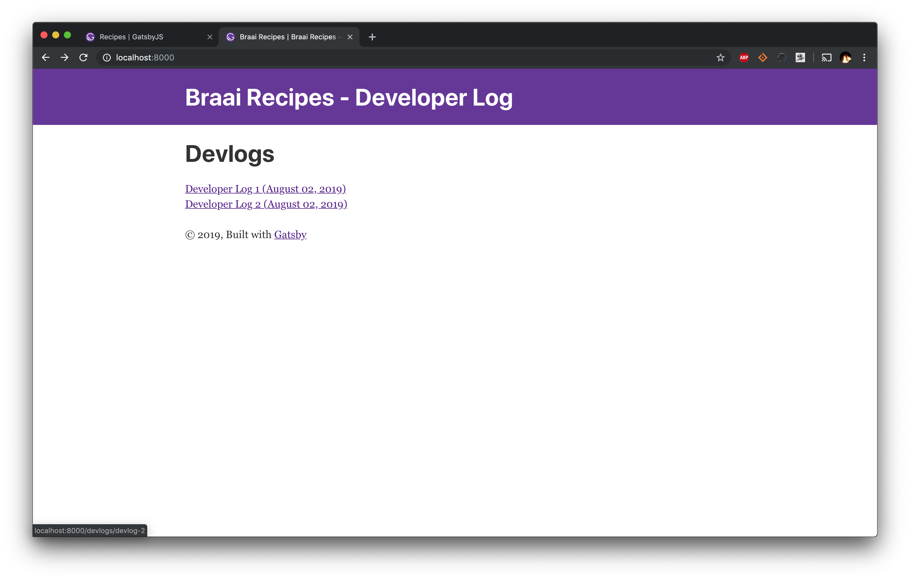

So to install Gastby.js I needed `npm` and to install `npm` on Mac OS I needed to update Homebrew which I have hadn't done it ages so it hung and I Ctrl+C'ed it and now I am not sure if it worked or not cause it looked like it was killed but it seems to work. Whatever.

I installed the gatsby-cli by following the instructions at their [Quick Start](https://www.gatsbyjs.org/docs/quick-start).

`npm install -g gatsby-cli`


Sweet! That worked! I know have the cli and can do all the cool commands I am yet to learn about from the command line. 

Create a new site:

`gatsby new braai-recipes`


Head it the directory and run:

`gatsby develop`

Head over to [http://localhost:8080](http://localhost:8080). It's up!


Nice!

Now Thor mentioned I can add posts in Markdown. That sounds great as I don't want every page to be a hand written React Component. React is cool, but not that cool.

There a [Recipes](https://www.gatsbyjs.org/docs/recipes/) page which seems to be able to tell me what I want to know.

Looks like if I want to create pages using the API there is a recipe I can use to do that. Just need some npm dependencies.

`npm install --save gatsby-source-filesystem`

`npm install --save gatsby-transformer-remark`


Ok, now I need to modify my `gatsby-config.js` file to point to where my Markdown files are going to live. 

```javascript
plugins: [
    .
    .
    .
    `gatsby-transformer-remark`,
    {
      resolve: `gatsby-source-filesystem`,
      options: {
        name: `content`,
        path: `${__dirname}/src/content`,
      },
    },
    .
    .
    .
  ]
```
I have 2 logs already so I'll chuck them in there and add some metadata to them which will tell the Gatsby Markdown tool what these are, when I wrote them and where they belong. 

```markdown
---
title: Devloper Log 1
date: 2019-08-02
path: /devlog/devlog-1
---

I went to the pub today after work with Thor and we got chatting abour React, Gatsby.js, Netlify and his 
```

Now I need to add a GraphQL Query to my `gatsby-node.js` file. This file as I learnt today is the file that hits API's when building your static site to figure out what contennt/stuff to build. 

```javascript
// ./gatsby-node.js
const path = require(`path`)
exports.createPages = async ({ actions, graphql }) => {
  const { createPage } = actions
  const blogPostTemplate = path.resolve(`src/templates/post.js`)
  const result = await graphql(`
    {
      allMarkdownRemark(
        sort: { order: DESC, fields: [frontmatter___date] }
        limit: 1000
      ) {
        edges {
          node {
            frontmatter {
              path
            }
          }
        }
      }
    }
  `)
  if (result.errors) {
    console.log(result.errors)
    throw new Error("Things broke, see console output above")
  }
  result.data.allMarkdownRemark.edges.forEach(({ node }) => {
    createPage({
      path: node.frontmatter.path,
      component: blogPostTemplate,
      context: {}, // additional data can be passed via context
    })
  })
}
```

I don't know shit about GraphQL. Having looked at many a API request and SQL Query it looks like its doing a request to a GraphQL API asking for posts orderd by the date they were published descending. So most recent first. 

If that Promise revoles it takes all the edges (I think those are hits) and creates some page from them into the path specified in the metadata and using some sort of Javascript template at `src/templates/post.js` which definitely does not exist right. now. 

Lets create that.

```javascript
// src/templates/post.js
import React from "react"
import { graphql } from "gatsby"
export default function Template({ data }) {
  const { markdownRemark } = data // data.markdownRemark holds your post data
  const { frontmatter, html } = markdownRemark
  return (
    <div className="blog-post">
      <h1>{frontmatter.title}</h1>
      <h2>{frontmatter.date}</h2>
      <div
        className="blog-post-content"
        dangerouslySetInnerHTML={{ __html: html }}
      />
    </div>
  )
}
export const pageQuery = graphql`
  query($path: String!) {
    markdownRemark(frontmatter: { path: { eq: $path } }) {
      html
      frontmatter {
        date(formatString: "MMMM DD, YYYY")
        path
        title
      }
    }
  }
`
```

So this is a React component which seems to define and component and then export (make available for importing) some sort of GraphQL Query/Result? Not really sure what this export is doing. 

Saved everything and Gatsby is meant to rebuild in development mode but it looks like it has hit some form of error


No idea, let me bring down the dev server and back up


Better error message anyway. Looks like I fat fingered something when C&Ping code or I missed something. Looks like a complaint about the paths when creating pages. Either my MD files are fecked, my Node API can't find them or my template can't create them. 

Ah, I forgot to save one of my Markdown files when I added the header (so it didn't have a page). Would have been nice if the tool told me a file was missing metadata. Anyway I have content!


Looks like I have some typos though. Sweet!

Now what I would like is some sort of index on my index page that lists my blog posts. Looks like the dudes at Gatsby have my back [Adding a List of Markdown Blog Posts](https://www.gatsbyjs.org/docs/adding-a-list-of-markdown-blog-posts/)

Ok I need to update the Index React component

> Did you know that the round brackets after defining a function in Javascript are some sort of "Just do what I asked you do do an return the result" thing. If you want to defined some methods and do some things you should use curly brackets? 
Well I did not. TIL

So I update my index.js to the suggested code with some Modifications to the returned HTML. 

```javascript
// ./src/pages/index.js
import React from "react"

import Layout from "../components/layout"
import SEO from "../components/seo"

import { graphql } from "gatsby"
import PostLink from "../components/post-link"

const IndexPage = ({
  data: {
    allMarkdownRemark: { edges },
  },
}) => {
  const Posts = edges
    .filter(edge => !!edge.node.frontmatter.date) // You can filter your posts based on some criteria
    .map(edge => <PostLink key={edge.node.id} post={edge.node} />)
  return 
  <Layout>
    <SEO title="Braai Recipes" />
    <h1>Devlogs</h1>
    <div>{Posts}</div>
  </Layout>
}

export default IndexPage
export const pageQuery = graphql`
  query {
    allMarkdownRemark(sort: { order: DESC, fields: [frontmatter___date] }) {
      edges {
        node {
          id
          excerpt(pruneLength: 250)
          frontmatter {
            date(formatString: "MMMM DD, YYYY")
            path
            title
          }
        }
      }
    }
  }
  `
  ```

  This looks like a Functional React Component taking in the GraphQL results as a param and mapping the edges to some sort of PostLink Component. Again to idea what that last GraphQL Query does. Need to create that PostLink Component though. 

```javascript
// ./src/components/post-link.js
import React from "react"
import { Link } from "gatsby"
const PostLink = ({ post }) => (
  <div>
    <Link to={post.frontmatter.path}>
      {post.frontmatter.title} ({post.frontmatter.date})
    </Link>
  </div>
)
export default PostLink
```

Nice simple component that creates a link to a post's path showing the Title and the Date. (Looks like the GraphQL Query might have something to do with the props on this component.  Because the params in `frontmatter` seem to be being accessed from the props here. Maybe that GraphQL export defines some sort of query that you can run over that component? 

Look at that!



Ok I want to change the name and add some space after the logs I guess. 

Based on how the original index did it I am going to stick in a `div` into my `index.js` with some CSS to tell it to chill out and give my list some space. 

```javascript
// ./src/pages/index.js
.
.
.
  return (
  <Layout>
    <SEO title="Braai Recipes" />
    <h1>Devlogs</h1>
    <div>{Posts}</div>
    <div style={{ maxWidth: `300px`, marginBottom: `1.45rem` }}>
    </div>
  </Layout>
.
.
.
```

Not sure what `1.45rem` is but sure. That


Perfect


It would be great if I can add images to my posts. Looks like I can with [Inline images with gatsby-remark-images](https://www.gatsbyjs.org/docs/working-with-images-in-markdown/#inline-images-with-gatsby-remark-images)

Need to a npm install

`npm install --save gatsby-remark-images gatsby-plugin-sharp`

Then update my gatsby config file where I tell plugins what to do. But its pretty confusing where to put this. It looks like I already have something with `gatsby-plugin-sharp` so I am going to pop it in under that.

```javascript
`gatsby-plugin-sharp`,
    {
      resolve: `gatsby-plugin-mdx`,
      options: {
        gatsbyRemarkPlugins: [
          {
            resolve: `gatsby-remark-images`,
            options: {
              maxWidth: 1200,
            },
          },
        ],
      },
    },
    {
      resolve: `gatsby-source-filesystem`,
      options: {
        path: `${__dirname}/src/pages`,
      },
    },
    {
      resolve: `gatsby-plugin-manifest`,
```


Hmmm this doesn't work. When I try and re-run gatsby I get


If I try and install that lib I get

.[Second MDX Error](./second-mdx-error.png)

Looks like some dependencies aren't being installed. looking at the [plugin](https://www.gatsbyjs.org/packages/gatsby-plugin-mdx/) listing for `gatsby-plugin-mdx` I need to install some other stuff. 

`npm install --save gatsby-plugin-mdx @mdx-js/mdx @mdx-js/react`

That works but I dont see my image using

``


Hmmm my images definitely aren't loading and I don't know why. A fight for tomorrow. 

Lets see can I deploy this using Netlify. Ill create a repo on github, push the code to it and figure it out from there. 

Let me update my `package.json` first to make sure the owner and repo URL are corret

```javascript
{
  "name": "braai-recipes",
  "private": true,
  "description": "A Gatsby Blog for my Braai Recipes",
  "version": "0.1.0",
  "author": "Mike Shaw <mike.and.shaw@gmail.com>",
  "dependencies": {
    "gatsby": "^2.13.45",
    "gatsby-image": "^2.2.7",
    "gatsby-plugin-manifest": "^2.2.4",
    "gatsby-plugin-offline": "^2.2.4",
    "gatsby-plugin-react-helmet": "^3.1.2",
    "gatsby-plugin-sharp": "^2.2.9",
    "gatsby-remark-copy-linked-files": "^2.1.4",
    "gatsby-remark-images": "^3.1.7",
    "gatsby-source-filesystem": "^2.1.8",
    "gatsby-transformer-remark": "^2.6.10",
    "gatsby-transformer-sharp": "^2.2.5",
    "prop-types": "^15.7.2",
    "react": "^16.8.6",
    "react-dom": "^16.8.6",
    "react-helmet": "^5.2.1"
  },
  "devDependencies": {
    "prettier": "^1.18.2"
  },
  "keywords": [
    "gatsby"
  ],
  "license": "MIT",
  "scripts": {
    "build": "gatsby build",
    "develop": "gatsby develop",
    "format": "prettier --write src/**/*.{js,jsx}",
    "start": "npm run develop",
    "serve": "gatsby serve",
    "test": "echo \"Write tests! -> https://gatsby.dev/unit-testing\""
  },
  "repository": {
    "type": "git",
    "url": "https://github.com/mandshaw/braai-recipes"
  },
  "bugs": {
    "url": "https://github.com/mandshaw/braai-recipes/issues"
  }
}
```

Cool now lets read about [deploying](https://www.gatsbyjs.org/docs/hosting-on-netlify/#git-repository-setup)

When I log into Netlify I simply configure Netlify to listen on my git repo


It detects it's a gatsby site. I tell it to have at it!


Deploy!


I configured my custom domain to work with this build as well!


We are live!



:rocket:

I am online after 3 hours and 12 mins! Not bad gatsby and Netlify. Not bad.


