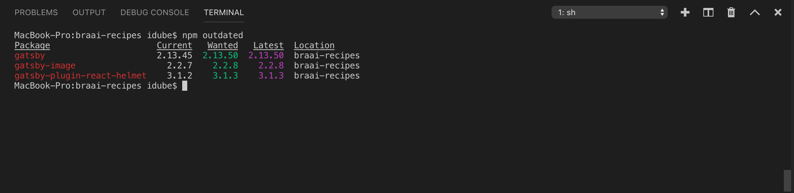
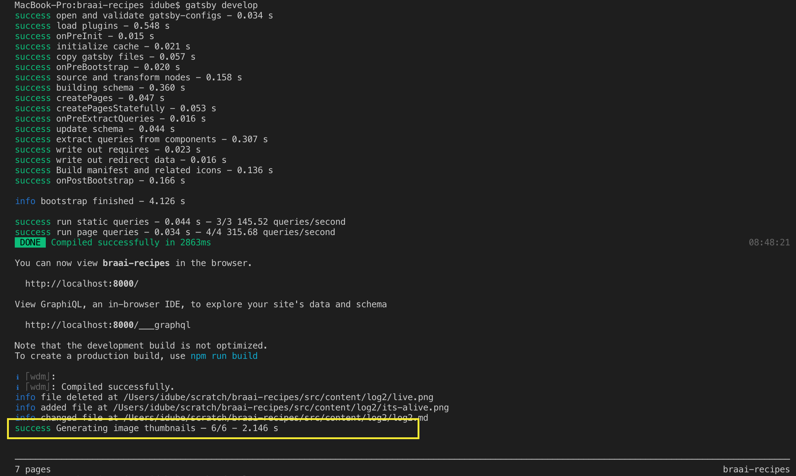
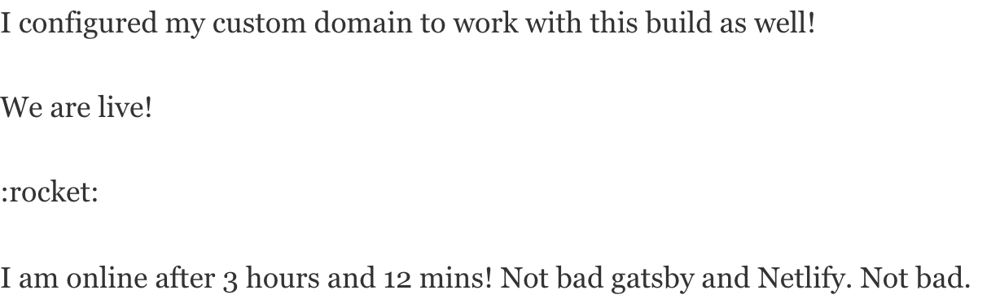

So I launched the site yesterday!

It was pretty easy and good fun but unfortuatenly all my images aren't loading. It looks like some sort of configuration issue as I have the plugins that claim to get images to work but they ain't working. 

Goals:
- [Fix Images](#fix-images)
- [Fix Emoji](#fix-emoji)
- [Add Google Anayltics](#google-analytics)

## Fix Images

So I read that `npm outdated` will tell you if anything is out of date and [some googling](https://github.com/gatsbyjs/gatsby/issues/9172) suggests that I should update my plugins. 



Doesn't seem to have worked though. 

[This guy](https://whoisryosuke.com/blog/2019/getting-started-developing-shopify-themes/) has images in his posts and from lurking in his github repo he uses Markdown files. In his `gatsby-config.js` it looks like he nests his dependencies properly.

```javascript
resolve: `gatsby-transformer-remark`,
      options: {
        plugins: [
          "gatsby-remark-copy-linked-files",
          {
            resolve: `gatsby-remark-images`,
            options: {
              maxWidth: 1080,
            },
          },
```

Mine is a mess I have 3 instances of `gatsby-transformer-mark` in mine:

```javascript
// gatsby-config.js
module.exports = {
  siteMetadata: {
    title: `Braai Recipes - Developer Log`,
    description: `The logs of a developer trying build a PWA Blog for his pastimes recipe's.`,
    author: `@mandshaw`,
  },
  plugins: [
    `gatsby-plugin-react-helmet`,
    `gatsby-transformer-sharp`,
    `gatsby-plugin-sharp`,
    {
      resolve: `gatsby-transformer-remark`,
      options: {
        plugins: [
          {
            resolve: `gatsby-remark-images`,
            options: {
              // It's important to specify the maxWidth (in pixels) of
              // the content container as this plugin uses this as the
              // base for generating different widths of each image.
              maxWidth: 590,
            },
          },
        ],
      },
    },
    {
      resolve: `gatsby-source-filesystem`,
      options: {
        path: `${__dirname}/src/pages`,
      },
    },
    {
      resolve: `gatsby-plugin-manifest`,
      options: {
        name: `gatsby-starter-default`,
        short_name: `starter`,
        start_url: `/`,
        background_color: `#663399`,
        theme_color: `#663399`,
        display: `minimal-ui`,
        icon: `src/images/gatsby-icon.png`, // This path is relative to the root of the site.
      },
    },
    `gatsby-transformer-remark`,
    {
      resolve: `gatsby-source-filesystem`,
      options: {
        name: `content`,
        path: `${__dirname}/src/content`,
      },
    },
    {
      resolve: `gatsby-source-filesystem`,
      options: {
        path: `${__dirname}/src/images`,
        name: 'images',
      },
    },
    {
      resolve: `gatsby-transformer-remark`,
      options: {
        plugins: ["gatsby-remark-copy-linked-files"],
      },
    },
    // this (optional) plugin enables Progressive Web App + Offline functionality
    // To learn more, visit: https://gatsby.dev/offline
    // `gatsby-plugin-offline`,
  ],
}
```

After clean:

```javascript
{
    resolve: `gatsby-transformer-remark`,
      options: {
        plugins: [
          "gatsby-remark-copy-linked-files",
          {
            resolve: `gatsby-remark-images`,
            options: {
              // It's important to specify the maxWidth (in pixels) of
              // the content container as this plugin uses this as the
              // base for generating different widths of each image.
              maxWidth: 590,
            },
          },
        ],
      },
    }
```

When I run `gatsby develop` I can now see something about image thumbnails. That is good! It now works!




So now I can just stick images for a post in the folder of the post. 

```shell
└── log3
    ├── images-working.png
    ├── log3.md
    ├── thumbnails.png
    └── update-deps.png
```

## Fix Emoji

My rocket emoji in [Developer Log 2](/devlogs/devlog-2) isn't showing. 



Quick google found me [this plugin](https://github.com/matchilling/gatsby-remark-emojis)

`npm install --save gatsby-remark-emojis`

Update my `gatsby-config.js` to include the new plugin (Rembering to nest it under the existing `gatsby-transformer-remark` plugin).

```javascript
      resolve: `gatsby-transformer-remark`,
      options: {
        plugins: [
          "gatsby-remark-copy-linked-files",
          {
            resolve: `gatsby-remark-images`,
            options: {
              // It's important to specify the maxWidth (in pixels) of
              // the content container as this plugin uses this as the
              // base for generating different widths of each image.
              maxWidth: 590,
            },
          },
          {
            resolve: 'gatsby-remark-emojis',
            options: {
              // Deactivate the plugin globally (default: true)
              active : true,
              // Add a custom css class
              class  : 'emoji-icon',
              // Select the size (available size: 16, 24, 32, 64)
              size   : 64,
              // Add custom styles
              styles : {
                display      : 'inline',
                margin       : '0',
                'margin-top' : '1px',
                position     : 'relative',
                top          : '5px',
                width        : '25px'
              }
            }
          }
        ],
      },
```

My rocket is now a :rocket:

Gatsby Plugins. Sick

## Google Analytics

I want to be able to see what my website traffic is like using Google Analytics. It [looks easy](https://www.gatsbyjs.org/docs/adding-analytics/) to setup.

`npm install --save gatsby-plugin-google-analytics`

```javascript
// gatsby-config.js
module.exports = {
  siteMetadata: {
    title: `Braai Recipes - Developer Log`,
    description: `The logs of a developer trying build a PWA Blog for his pastimes recipe's.`,
    author: `@mandshaw`,
  },
  plugins: [
    `gatsby-plugin-react-helmet`,
    .
    .
    .
    {
      resolve: `gatsby-plugin-google-analytics`,
      options: {
        // replace "UA-XXXXXXXXX-X" with your own Tracking ID
        trackingId: "UA-145050524-1",
      },
    },
    .
    .
    .
  ],
}
```

I just push this to master and Netlify detects the change, builds my gatsby site as static content and pushed it to their CDN. Neat.