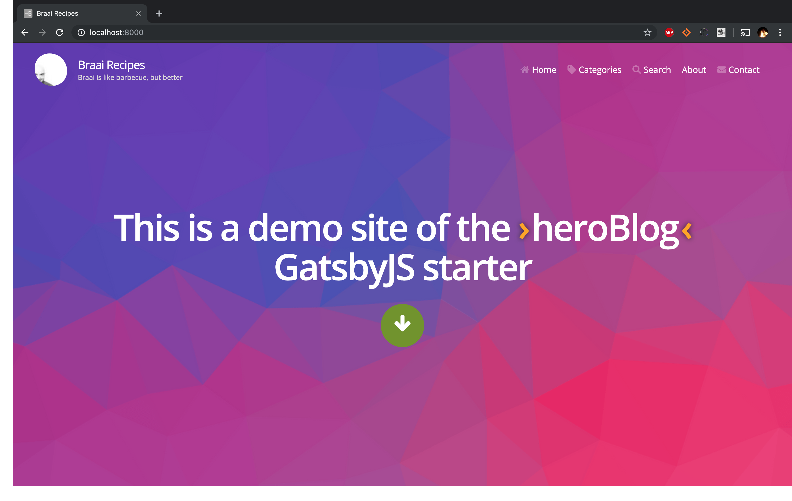

My goal for today is to make my site prettier. I had a great Braai yesterday, so I have my first few posts about that but at the moment the site is kind of ugly. 

What I would like:
- Support for multiple "blogs" or categories
- Search
- Categories
- Markdown support (So I can move my existing posts over)

GatsbyJS has a great library of Themes available over at the [Starter Library](https://www.gatsbyjs.org/starters/)


Searching for one that has Markdown support I came across [this](https://github.com/greglobinski/gatsby-starter-hero-blog) one which I like the look of.

So I am going to create a new site from it, port over all my existing posts and stuff and then see where we are at. :cold_sweat:.

## Create a new site using the Theme

Using the `gatsby-cli` I just create a new site from greglobinski's starter theme. 

`gatsby new braai-recipes-v2 https://github.com/greglobinski/gatsby-starter-hero-blog.git`

```shell

MacBook-Pro:~ idube$ gatsby new scratch/braai-recipes-v2 https://github.com/greglobinski/gatsby-starter-hero-blog.git
info Creating new site from git: https://github.com/greglobinski/gatsby-starter-hero-blog.git

Cloning into 'scratch/braai-recipes-v2'...
remote: Enumerating objects: 1, done.
remote: Counting objects: 100% (1/1), done.
remote: Total 768 (delta 0), reused 1 (delta 0), pack-reused 767
Receiving objects: 100% (768/768), 9.29 MiB | 11.72 MiB/s, done.
success Created starter directory layout
info Installing packages...

npm WARN deprecated postcss-cssnext@3.1.0: 'postcss-cssnext' has been deprecated in favor of 'postcss-preset-env'. Read more at https://moox.io/blog/deprecating-cssnext/
npm WARN deprecated @babel/polyfill@7.4.4: 🚨 As of Babel 7.4.0, this
npm WARN deprecated package has been deprecated in favor of directly
npm WARN deprecated including core-js/stable (to polyfill ECMAScript
npm WARN deprecated features) and regenerator-runtime/runtime
npm WARN deprecated (needed to use transpiled generator functions):
npm WARN deprecated 
npm WARN deprecated   > import "core-js/stable";
npm WARN deprecated   > import "regenerator-runtime/runtime";
npm WARN deprecated bfj-node4@5.3.1: Switch to the `bfj` package for fixes and new features!
npm WARN deprecated browserslist@2.11.3: Browserslist 2 could fail on reading Browserslist >3.0 config used in other tools.
npm WARN deprecated flatten@1.0.2: I wrote this module a very long time ago; you should use something else.
npm WARN deprecated joi@11.4.0: This version has been deprecated in accordance with the hapi support policy (hapi.im/support). Please upgrade to the latest version to get the best features, bug fixes, and security patches. If you are unable to upgrade at this time, paid support is available for older versions (hapi.im/commercial).
npm WARN deprecated core-js@1.2.7: core-js@<2.6.8 is no longer maintained. Please, upgrade to core-js@3 or at least to actual version of core-js@2.
npm WARN deprecated browserslist@1.7.7: Browserslist 2 could fail on reading Browserslist >3.0 config used in other tools.
npm WARN deprecated hoek@4.2.1: This version has been deprecated in accordance with the hapi support policy (hapi.im/support). Please upgrade to the latest version to get the best features, bug fixes, and security patches. If you are unable to upgrade at this time, paid support is available for older versions (hapi.im/commercial).
npm WARN deprecated topo@2.0.2: This version has been deprecated in accordance with the hapi support policy (hapi.im/support). Please upgrade to the latest version to get the best features, bug fixes, and security patches. If you are unable to upgrade at this time, paid support is available for older versions (hapi.im/commercial).
npm WARN deprecated circular-json@0.3.3: CircularJSON is in maintenance only, flatted is its successor.

> fsevents@1.2.9 install /Users/idube/scratch/braai-recipes-v2/node_modules/fsevents
> node install

node-pre-gyp WARN Using request for node-pre-gyp https download 
[fsevents] Success: "/Users/idube/scratch/braai-recipes-v2/node_modules/fsevents/lib/binding/Release/node-v72-darwin-x64/fse.node" is installed via remote

> deasync@0.1.15 install /Users/idube/scratch/braai-recipes-v2/node_modules/deasync
> node ./build.js

`darwin-x64-node-12` exists; testing
Binary is fine; exiting

> sharp@0.22.1 install /Users/idube/scratch/braai-recipes-v2/node_modules/sharp
> (node install/libvips && node install/dll-copy && prebuild-install) || (node-gyp rebuild && node install/dll-copy)

info sharp Using cached /Users/idube/.npm/_libvips/libvips-8.7.4-darwin-x64.tar.gz

> core-js@2.6.9 postinstall /Users/idube/scratch/braai-recipes-v2/node_modules/core-js
> node scripts/postinstall || echo "ignore"

Thank you for using core-js ( https://github.com/zloirock/core-js ) for polyfilling JavaScript standard library!

The project needs your help! Please consider supporting of core-js on Open Collective or Patreon: 
> https://opencollective.com/core-js 
> https://www.patreon.com/zloirock 

Also, the author of core-js ( https://github.com/zloirock ) is looking for a good job -)


> core-js-pure@3.1.4 postinstall /Users/idube/scratch/braai-recipes-v2/node_modules/core-js-pure
> node scripts/postinstall || echo "ignore"

Thank you for using core-js ( https://github.com/zloirock/core-js ) for polyfilling JavaScript standard library!

The project needs your help! Please consider supporting of core-js on Open Collective or Patreon: 
> https://opencollective.com/core-js 
> https://www.patreon.com/zloirock 

Also, the author of core-js ( https://github.com/zloirock ) is looking for a good job -)


> gatsby-telemetry@1.1.11 postinstall /Users/idube/scratch/braai-recipes-v2/node_modules/gatsby-telemetry
> node src/postinstall.js


> cwebp-bin@5.1.0 postinstall /Users/idube/scratch/braai-recipes-v2/node_modules/cwebp-bin
> node lib/install.js

  ✔ cwebp pre-build test passed successfully

> mozjpeg@6.0.1 postinstall /Users/idube/scratch/braai-recipes-v2/node_modules/mozjpeg
> node lib/install.js

  ✔ mozjpeg pre-build test passed successfully

> pngquant-bin@5.0.2 postinstall /Users/idube/scratch/braai-recipes-v2/node_modules/pngquant-bin
> node lib/install.js

  ✔ pngquant pre-build test passed successfully
npm notice created a lockfile as package-lock.json. You should commit this file.
npm WARN gatsby-plugin-styled-jsx@3.1.2 requires a peer of styled-jsx@^3.0.2 but none is installed. You must install peer dependencies yourself.
npm WARN react-addons-perf@15.4.2 requires a peer of react-dom@^15.4.2 but none is installed. You must install peer dependencies yourself.
npm WARN eslint-config-react-app@3.0.8 requires a peer of babel-eslint@9.x but none is installed. You must install peer dependencies yourself.
npm WARN ts-pnp@1.1.2 requires a peer of typescript@* but none is installed. You must install peer dependencies yourself.
npm WARN react-instantsearch-native@5.7.0 requires a peer of react-native@>= 0.32.0 but none is installed. You must install peer dependencies yourself.
npm WARN eslint-plugin-graphql@2.1.1 requires a peer of graphql@^0.12.0 || ^0.13.0 but none is installed. You must install peer dependencies yourself.
npm WARN gatsby-starter-hero-blog@2.0.0 No repository field.

added 2792 packages from 1422 contributors and audited 47277 packages in 71.305s
found 5 vulnerabilities (1 low, 2 moderate, 2 high)
info Initialising git in scratch/braai-recipes-v2

info Create initial git commit in scratch/braai-recipes-v2

info Initialising git in scratch/braai-recipes-v2
```

Hmmm that seemed to do a sufficient amount of complaining to freak me out. Looks like there are some definite vulnerabilities and a lot of deprecated packages.

A quick `npm audit fix` says it can't auto fix them without breaking stuff. 

Lets see if the site can launch. 

`gatsby develop`


No errors in the console and no emails from russians asking me for bitcoins so far so I guess everything is ok :information_desk_person:.

Right lets go scratch around and Hack it!

## Hack it to do what I want

What I want to do is:
- Change the Menu bar
- Change the Avatar in the header
- Change the Picture and Text that is on the home page
- Add my posts
- Hook up search
- Link to my repo and social media profiles

### Change the Menu Bar

So if I open our new site I know that the Menu bar is in the sites "Header" and that chances are the Header and the Menu bar are React components. And that components live in the componets dir in the src folder of a gatsby site (Unless you're mad).

Bingo

```shell
├── src
│   ├── components
│   │   ├── Article
│   │   │   ├── Article.js
│   │   │   ├── Bodytext.js
│   │   │   ├── Headline.js
│   │   │   └── index.js
│   │   ├── AsyncComponent
│   │   │   ├── AsyncComponent.js
│   │   │   └── index.js
│   │   ├── Blog
│   │   │   ├── Blog.js
│   │   │   ├── Item.js
│   │   │   └── index.js
│   │   ├── Contact
│   │   │   ├── Contact.js
│   │   │   └── index.js
│   │   ├── Footer
│   │   │   ├── Footer.js
│   │   │   └── index.js
│   │   ├── Header
│   │   │   ├── Header.js
│   │   │   └── index.js
│   │   ├── Hero
│   │   │   ├── Hero.js
│   │   │   └── index.js
│   │   ├── List
│   │   │   ├── List.js
│   │   │   └── index.js
│   │   ├── Menu
│   │   │   ├── Expand.js
│   │   │   ├── Item.js
│   │   │   ├── Menu.js
│   │   │   └── index.js
│   │   ├── Page
│   │   │   ├── Page.js
│   │   │   └── index.js
│   │   ├── Post
│   │   │   ├── Author.js
│   │   │   ├── Comments.js
│   │   │   ├── Meta.js
│   │   │   ├── NextPrev.js
│   │   │   ├── Post.js
│   │   │   ├── Share.js
│   │   │   └── index.js
│   │   ├── Search
│   │   │   ├── Hit.js
│   │   │   ├── Search.js
│   │   │   └── index.js
│   │   └── Seo
│   │       ├── Seo.js
│   │       └── index.js

```

Why is there no emoji for :rubbing-hands-eagerly:. So when I look at the header component I can see references to a config file. 


Looking in there I can see lots of things to configure. Let me reconfigure to what makes sense for me.  

```javascript
module.exports = {
  siteTitle: "Braai Recipes", // <title>
  shortSiteTitle: "Braai Recipes", // <title> ending for posts and pages
  siteDescription: "Braai Recipes is a blog about recipes I like to braai",
  siteUrl: "https://www.braai.recipes",
  // pathPrefix: "",
  siteImage: "preview.jpg",
  siteLanguage: "en",

  /* author */
  authorName: "Michael Shaw",
  authorTwitterAccount: "mickashaw",

  /* info */
  headerTitle: "Braai Recipes",
  headerSubTitle: "Braai is like barbecue, but better",

  /* manifest.json */
  manifestName: "Braai Recipes",
  manifestShortName: "Braai Recipes", // max 12 characters
  manifestStartUrl: "/index.html",
  manifestBackgroundColor: "white",
  manifestThemeColor: "#666",
  manifestDisplay: "standalone",

  // gravatar
  // Use your Gravatar image. If empty then will use src/images/jpg/avatar.jpg
  // Replace your email adress with md5-code.
  // Example https://www.gravatar.com/avatar/g.strainovic@gmail.com ->
  // gravatarImgMd5: "https://www.gravatar.com/avatar/1db853e4df386e8f699e4b35505dd8c6",
  gravatarImgMd5: "",

  // social
  authorSocialLinks: [
    { name: "github", url: "https://github.com/mandshaw" },
    { name: "twitter", url: "https://twitter.com/mickashaw" }
  ]
};

```

Ok, starting to look better!


Lets, look at the Menu Component


The Menu component gets the pages from its props and then does a map on them and passes them to the items state which seems to tell the menu bar where each thing routes to and what its called. Menu gets the pages from the props. So that means the pages state is is the parent. To the Header!


The Header props are getting pages in *their* parent props. Which appears to be getting set in `src/layouts/index.js`


This prop is using the Markdown files in `src/content/pages` as a source in a GraphQL query based on the GraphQL Query being run in the `render` function.


Awesome. Lets head over there and delete the ones I don't want and edit the ones I do want. Tada!


Shit! 

Ok from the error:

```shell
GraphQL Error Encountered 1 error(s):
- Unknown field 'menuTitle' on type 'MarkdownRemarkFrontmatter'.

      file: /Users/idube/scratch/braai-recipes-v2/src/layouts/index.js
```

It can't find menuTitle in any of the Markdowns "frontmatter" (the yaml like stuff at the top of the MD files) Let me remove querying the menuTitle from that query. 

Wahoo!



OH NO!


A quick lurk (Did I ever mention how much I learn from lurking) on the starter [source code](https://raw.githubusercontent.com/greglobinski/gatsby-starter-hero-blog/master/content/pages/2--starters/index.md) seems to imply only png images are supported. Let me convert.

Wahoo!


### Change the Avatar in the header
That dude is not me, I need to fix that. 

Looking at the image in `src/images/jpg/avatar` it looks like it needs to be a 60x60 jpeg (I guess jpegs are supported :confused:)

Quick [Pixelmator Pro](https://www.pixelmator.com/pro/) work and Tada! That's me!


### Change the Picture and Text that is on the home page

Seen as I have Pixelmator open now would be a good time to replace the image on the home screen. It looks like it came from [pixabay](https://pixabay.com/) which looks like an index of free images. I found a one of a fire I like. 

Lets use Pixelmator to make it the same size as the original image

In Pixelmater I scale the Image down to the same width as the original, 3840 pixels.


I then need to crop the height


Then I export to png


Now I search using VSCode for what is using the original image and replace it with my image. Looks like its part of the GraphQL Query at the bottom of `src/pages/index.js` that is using ImageSharp to generate different image sizes for different devices. Neat!

```javascript
// src/pages/index
export const query = graphql`
  query IndexQuery {
    posts: allMarkdownRemark(
      filter: { fileAbsolutePath: { regex: "//posts/[0-9]+.*--/" } }
      sort: { fields: [fields___prefix], order: DESC }
    ) {
      edges {
        node {
          excerpt
          fields {
            slug
            prefix
          }
          frontmatter {
            title
            category
            author
            cover {
              children {
                ... on ImageSharp {
                  fluid(maxWidth: 800, maxHeight: 360) {
                    ...GatsbyImageSharpFluid_withWebp
                  }
                }
              }
            }
          }
        }
      }
    }
    site {
      siteMetadata {
        facebook {
          appId
        }
      }
    }
    bgDesktop: imageSharp(fluid: { originalName: { regex: "/hero-background/" } }) {
      resize(width: 1200, quality: 90, cropFocus: CENTER) {
        src
      }
    }
    bgTablet: imageSharp(fluid: { originalName: { regex: "/hero-background/" } }) {
      resize(width: 800, height: 1100, quality: 90, cropFocus: CENTER) {
        src
      }
    }
    bgMobile: imageSharp(fluid: { originalName: { regex: "/hero-background/" } }) {
      resize(width: 450, height: 850, quality: 90, cropFocus: CENTER) {
        src
      }
    }
  }
`;

//hero-background
```

Im going to replace the regexes to *"fire"*. Gatsby reloads. Tada


Let me fit that Text and that green button. They are both in the `src/components/Hero/Hero.js` component. 

```javascript
// src/components/Hero/Hero.js
import React from "react";
import PropTypes from "prop-types";

import { FaArrowDown } from "react-icons/fa/";

const Hero = props => {
  const { scrollToContent, backgrounds, theme } = props;

  return (
    <React.Fragment>
      <section className="hero">
        <h1>
          Welcome to braai.recipes
        </h1>
        <button onClick={scrollToContent} aria-label="scroll">
          <FaArrowDown />
        </button>
      </section>

      {/* --- STYLES --- */}
      <style jsx>{`
        .hero {
          align-items: center;
          background: ${theme.hero.background};
          background-image: url(${backgrounds.mobile});
          background-size: cover;
          color: ${theme.text.color.primary.inverse};
          display: flex;
          flex-flow: column nowrap;
          justify-content: center;
          min-height: 100vh;
          height: 100px;
          padding: ${theme.space.inset.l};
          padding-top: ${theme.header.height.homepage};
        }

        h1 {
          text-align: center;
          font-size: ${theme.hero.h1.size};
          margin: ${theme.space.stack.l};
          color: ${theme.hero.h1.color};
          line-height: ${theme.hero.h1.lineHeight};
          text-remove-gap: both 0 "Open Sans";

          :global(strong) {
            position: relative;

            &::after,
            &::before {
              content: "›";
              color: ${theme.text.color.attention};
              margin: 0 ${theme.space.xs} 0 0;
              text-shadow: 0 0 ${theme.space.s} ${theme.color.neutral.gray.k};
            }
            &::after {
              content: "‹";
              margin: 0 0 0 ${theme.space.xs};
            }
          }
        }

        button {
          background: ${theme.background.color.brand};
          border: 0;
          border-radius: 50%;
          font-size: ${theme.font.size.m};
          padding: ${theme.space.s} ${theme.space.m};
          cursor: pointer;
          width: ${theme.space.xl};
          height: ${theme.space.xl};

          &:focus {
            outline-style: none;
            background: ${theme.color.brand.primary.active};
          }

          :global(svg) {
            position: relative;
            top: 5px;
            fill: ${theme.color.neutral.white};
            stroke-width: 40;
            stroke: ${theme.color.neutral.white};
            animation-duration: ${theme.time.duration.long};
            animation-name: buttonIconMove;
            animation-iteration-count: infinite;
          }
        }
```

The button uses a color defined in `src/theme/theme.yaml`

```yaml
  brand:
    primary: &color-brand-primary '#709425'
```

I'd like a nice red from the flames. I use a picker, get the Hex and tada.


### Add my posts

Ok looking at how Greg did the posts on the demo I need to modify the way I post. He has:

```shell
└── posts
    ├── 2017-10-01--two-things-are-infinite
    │   ├── index.md
    │   └── photo-1490474418585-ba9bad8fd0ea.jpg
    ├── 2017-10-03--be-who-you-are
    │   ├── index.md
    │   └── photo-1489824904134-891ab64532f1.jpg
    ├── 2017-10-05--you-only-live-once
    │   ├── index.md
    │   └── photo-1456518563096-0ff5ee08204e.jpg
    ├── 2017-10-07--people-will-forget
    │   ├── index.md
    │   └── photo-1489900464632-5f5907edda24.jpg
    ├── 2017-10-09--i-am-so-clever
    │   ├── index.md
    │   └── photo-1507124484497-b7f446e65519.jpg
    ├── 2017-10-11--imperfection-is-beauty
    │   ├── index.md
    │   └── photo-1469461084727-4bfb496cf55a.jpg
    ├── 2017-10-13--there-are-only-two
    │   ├── index.md
    │   └── photo-1451324119451-db0ac857463c.jpg
    ├── 2017-10-15--good-friends
    │   ├── index.md
    │   └── photo-1500531279542-fc8490c8ea4d.jpg
    ├── 2017-10-17--i-have-not-failed
    │   ├── index.md
    │   └── photo-1463852247062-1bbca38f7805.jpg
    ├── 2017-10-19--i-may-not-have-gone
    │   ├── index.md
    │   └── photo-1507915600431-5292809c5ab7.jpg
    ├── 2017-10-21--like-nonsense
    │   ├── 33893097-e5a70c34-df5a-11e7-8f5e-40e057626770.png
    │   ├── index.md
    │   └── photo-1465070845512-2b2dbdc6df66.jpg
    └── draft-post
        ├── index.md
        └── photo-1490474418585-ba9bad8fd0ea.jpg
```

I'll change my posts to have the `{DATE}--{title}` folder syntax and my markdown files to be called `index.md`

Hmmm no post are showing, I can navigate to one via the URL and it shows briefly before complaining about an appId. Looking at the Stack trace it's something to do with Facebook. Fuck Facebook. Facebook is not welcome on my Blog!


Let me search for Facebookey things and delete them


Ok I had to delete the Comment component and a bunch of other stuff but I feel better now. Much better. I have also broken my site. But Facebook is not there. 

```shell
success update schema - 0.084 s
warn Using the global `graphql` tag is deprecated, and will not be supported in v3.
Import it instead like:  import { graphql } from 'gatsby' in file:
/Users/idube/scratch/braai-recipes-v2/node_modules/gatsby-plugin-algolia/example/src/layouts/index.js

 ERROR #85907  GRAPHQL

There was an error in your GraphQL query:

- Unknown field 'cover' on type 'MarkdownRemarkFrontmatter'. Source: document `PostsQuery` file: `GraphQL request`

File: src/templates/PostTemplate.js
```

Remember "Frontmatter" = Markdown Yaml. I am missing covers for my posts. Let me update. I can see my post now. 


Looks like the date is wrong though. It looks like because my post is in a devlogs folder it things its part of the date. Let me fix. 

I moved everything into the post folder like the original posts and now my site is broken. Something about a "TypeError: Cannot read property 'children' of null"


Well this is why I don't usually like JavaScript or any of this fancy new stuff. Its cool but saying that there is a TypeError on a Line where no casting, assignment or anything at all is happening is not very usefull at all.

I have isolated the error to only happening if I include devlog3 and something about the arrow.


It's 23:30pm and Eva is looking at me like I am in trouble. Delete it and lets ship

I am going to point this new dir at my git repo and push. If anything goes wrong I have my old dir. 

`git remote add origin https://github.com/mandshaw/braai-recipes.git`

The theme is going to make the repo look a little different, it's asking me to pull and I don't want to do that. 

`git push --force --set-upstream origin master`

Feck Algolia Broke the build!


OK Let me sign up for Algolia real quick as it looks like it just needs some environment variables. 

:pray:

It worked! Yay!