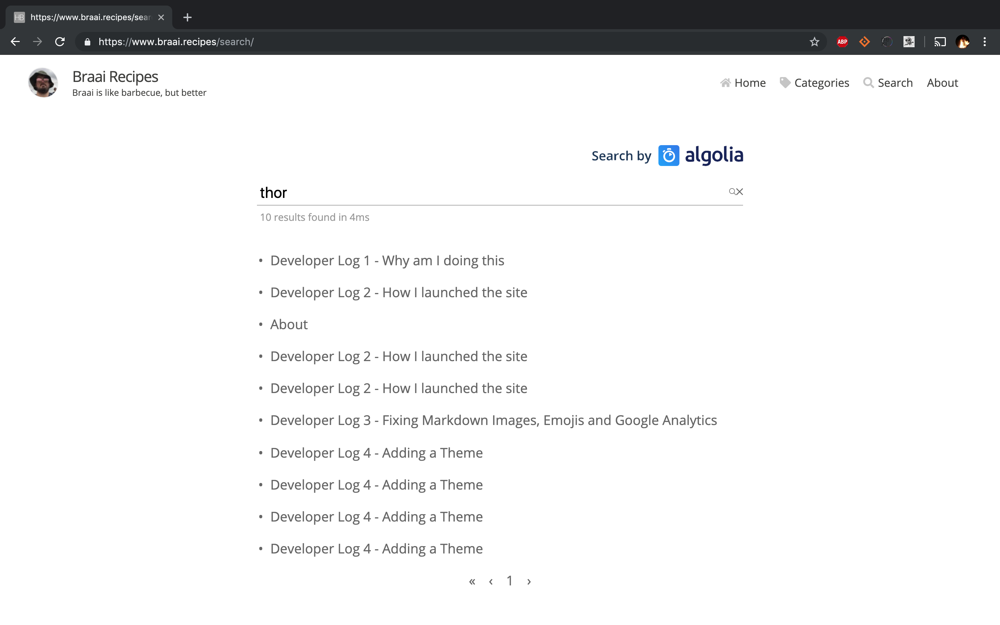
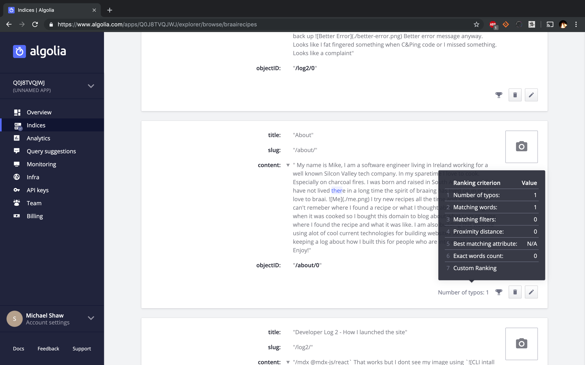
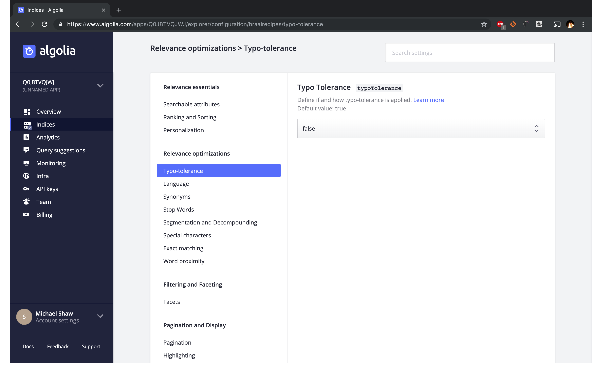
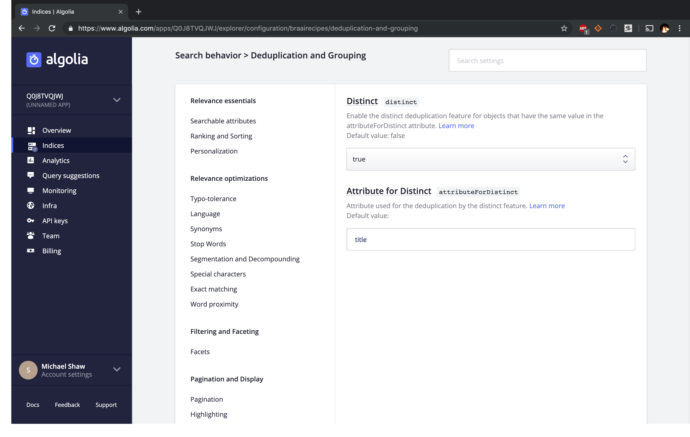
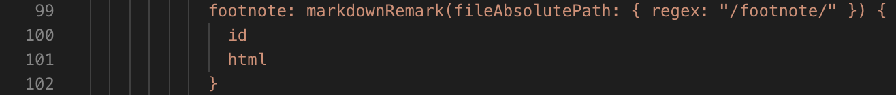
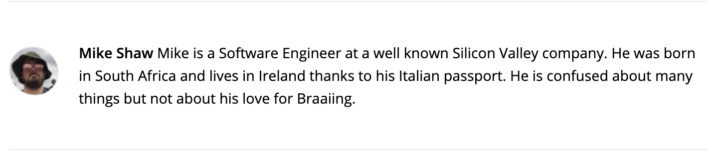

So, I launched the new themed site yesterday and added Algolia powered search in a hurry but it's a bit of a mess. 

Algolia is a service that you sign up to, point it at your website and it scrapes your content and puts them in an Index similar to ElasticSearch. You then put a Search bar on your site and configure it to point at your Algolia index. You can then search across your website and its **really** fast. 

However when I search for a word, "thor" in this case I get too many hits and duplicate hits.



The Algolia console on their website has a nice tester on the indices. 



Ok I can see they are doing fuzzy matching in order to support typos. I don't want that. I am going to configure the index and disable typo support. 



Ok a search for "braai" which is used alot returns duplicates as it used on many pages. I don't want duplicates. Let me configure that under "Search Behaviour" -> "Deduplication and Grouping"



Cool, my search is looking better.

I want to get rid of the Algolia logo so I modify the `src/pages/search.js` file to not include the icon above my search. 

## Fixing Bugs and Nits

My Navbar has Home when clicking my avatar goes to home. This is duplication, duplication is bad. I can remove it in the Menu component and move the about to the first one. 

```javascript
// src/components/Menu/Menu.js
.
.
.
class Menu extends React.Component {
  constructor(props) {
    super(props);
    this.itemList = React.createRef();

    const pages = props.pages.map(page => ({
      to: page.node.fields.slug,
      label: page.node.frontmatter.menuTitle
        ? page.node.frontmatter.menuTitle
        : page.node.frontmatter.title
    }));

    this.items = [
      ...pages,
      { to: "/category/", label: "Categories", icon: FaTag },
      { to: "/search/", label: "Search", icon: FaSearch },
    ];
    .
    .
    .
```

Also my footer is wrong


From the Layout React Component I can see that my footer comes in from a Markdown source on the GraphQL Query. So I can modify it there. 



```md
---
title: footnote
---

* Hacked together from [gatsby-starter-hero-blog](https://github.com/greglobinski/gatsby-starter-hero-blog)
* built by [mike shaw](https://ie.linkedin.com/in/mandshaw)
* delivered by [Netlify](https://www.netlify.com/)
```


Finally I want to fix the author blurb on the bottom of my posts. I am not Mr Gatsby.


Its coming in as a Markdown resource from GraphQL in the same folder as the footer. 

