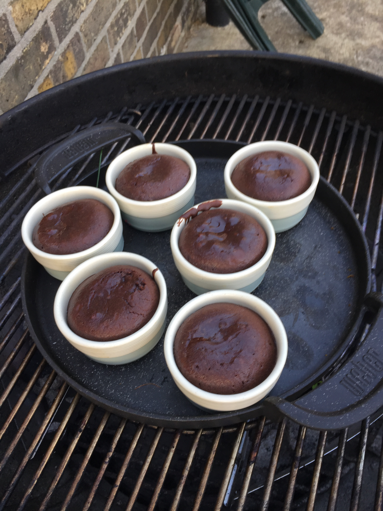

This recipe is from a [Weber's Greatest Hits](https://www.bookdepository.com/Webers-Greatest-Hits-Jamie-Purviance/9780544952379) book but you can see it on [their website](https://www.weber.com/IE/en/recipes/desserts/warm-molten-chocolate-cakes-with-fresh-berries/weber-89699.html) as well.

It's really good. I also learn't a variation of it at a Weber Essentials Grill school course. Which seems to be similar but uses Mascarpone and Caster sugar instead. 

I tend to cook a few courses and then put this on when my coals are dying down so the time in the book is a little too fast for me. I'd go around 20 mins. A good hint is if there is a wet patch about the size of a €2 coin on the top then you are good to take them off. That way they are still gooey in the middle :)

