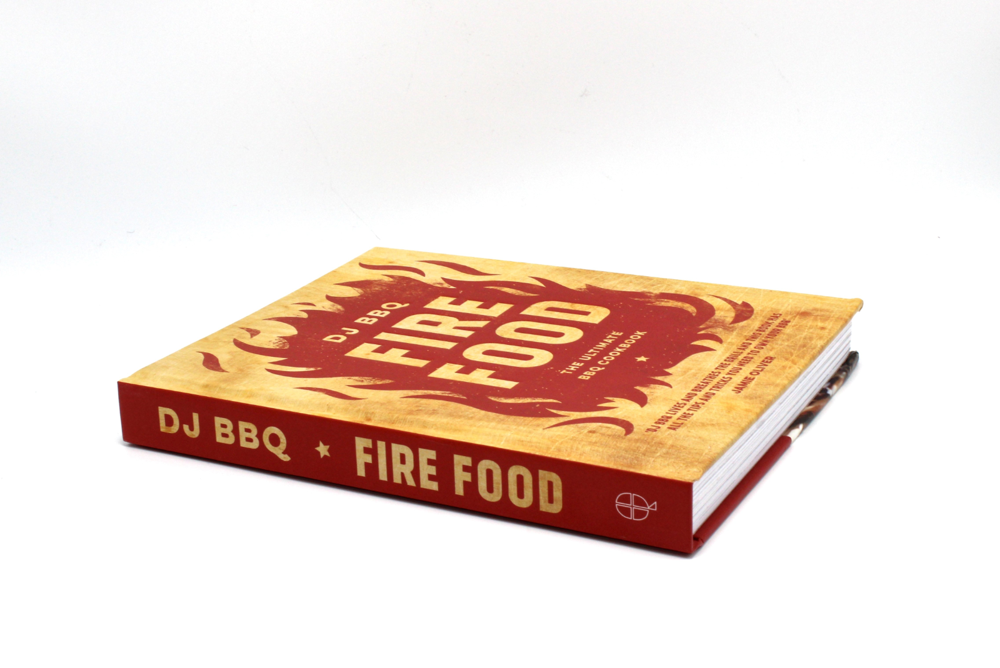

I don't often put carrots on the braai. Dunno why really. I think I am just biased to their paler and tastier cousins parsnips. Not sure. 

Anyway a good friend gave me **another** bbq book recently. [Fire Food](https://amzn.to/2MRHLwT) by [DJ BBQ](https://twitter.com/DJ_BBQ?ref_src=twsrc%5Egoogle%7Ctwcamp%5Eserp%7Ctwgr%5Eauthor). 

Not sure who DJ BBQ is or where he gets some of his outfits from but I really liked his idea of "Dirty" things. Basically cooking them on the coals. So I tried his Dirty carrots which is cooking carrots on the coals for about 20 mins and then coating them in Balsamic vinger, Maple Syrup and Cumin seeds. 

**IT WAS TASTY**

I don't have a good picture unforunately but here is a video. Where **does** he get his outfits! 

`youtube:https://www.youtube.com/embed/FbN9dy9tg-8`
