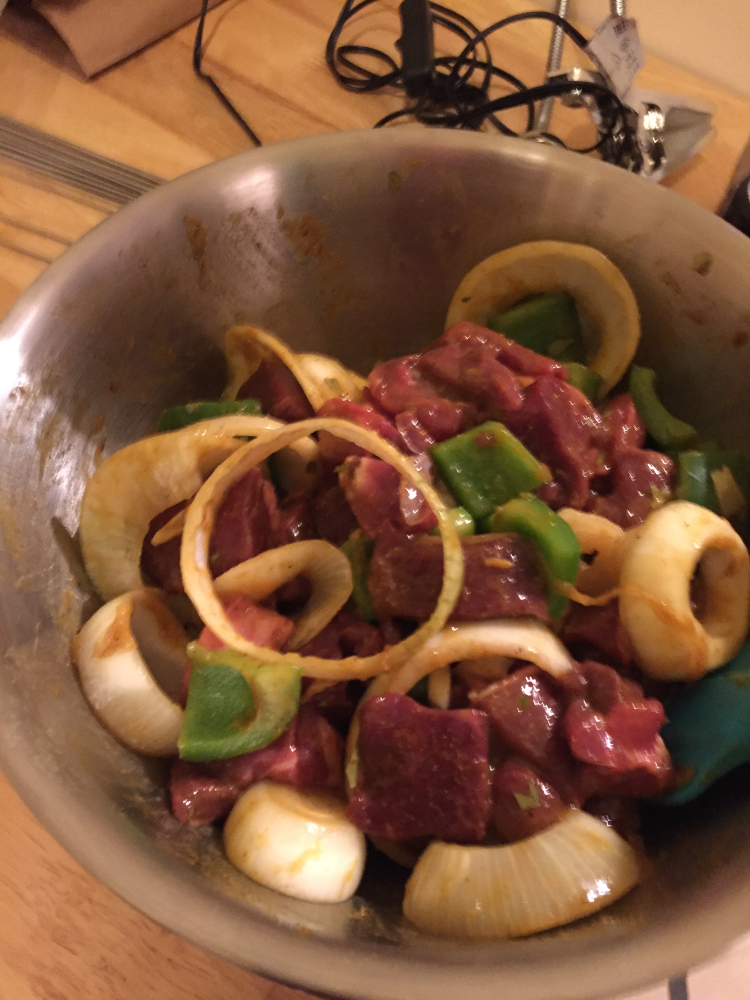
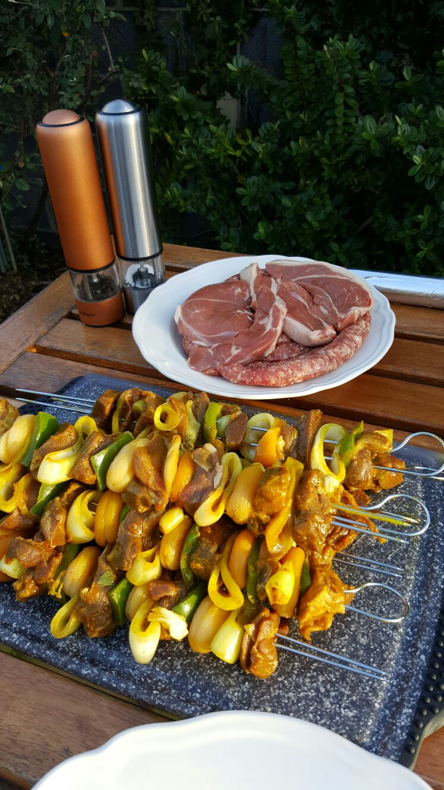
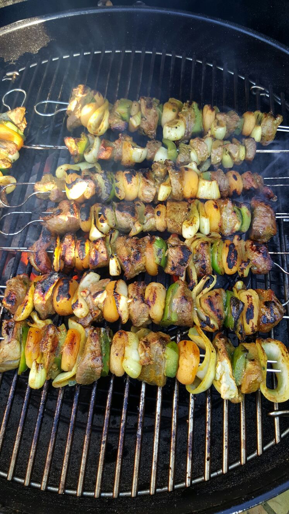
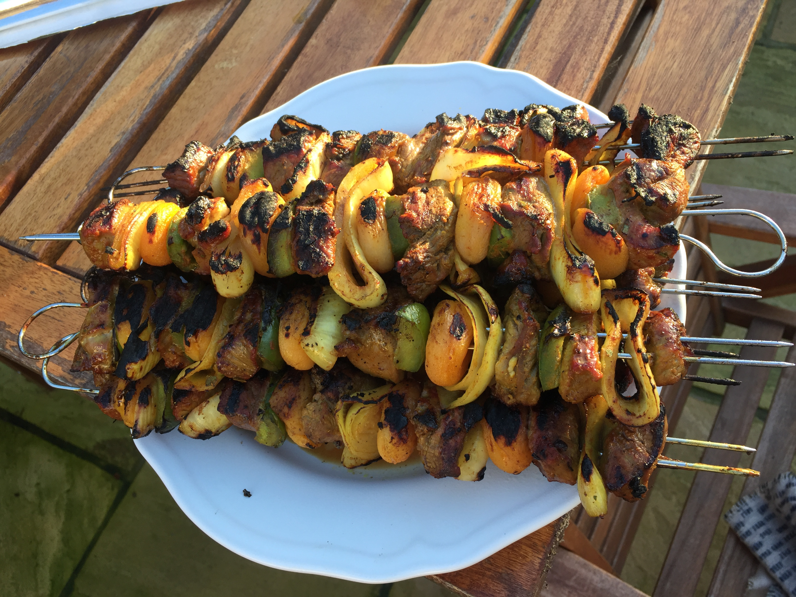

This is **the** recipes that made me want to build this website. 3.5 Years ago it was winter in Ireland, and we decided to have a family Braai in what we expected to be be close to 0 degrees celsius. January blues melted away by a toasty Braai. I found this recipe online, made it, loved it and then forgot where I found it and have been searching since!

Thanks to some digging I found the pictures and a write up I did incase I wanted to blog about it in the future! I love it when past me sends future me some tasty things!

I knew I wanted to cook lamb. The plan at first was to cook some Arrosticini. However after looking at some Arrosticini recipes I stumbled upon a fantastic recipe for some Lamb Sosaties (Lamb Skewers with a sweet/spicy marinade)

The recipe came from [cooksister.com](http://www.cooksister.com/2010/09/lamb-sosaties-revisited.html) and after reading it I had to try it

## Lamb Sosaties

* 500g boned leg of lamb, cut into 2.5cm cubes
* 3 tablespoons of smooth apricot jam
* 15 ml wine vinegar
* 2 large onions, both sliced into broad rings
* 50ml olive or cooking oil
* 2 cloves garlic, peeled and crushed
* 125g dried apricots
* One red, yellow or green pepper cut into approx 2.5cm squares
* 1 Tbsp curry powder (mild korma to hot madras – the choice is yours)
* 1 tsp turmeric
* 1 Tbsp brown sugar
* 2 crushed bay leaves
* ½ Tbsp salt
* ½ tsp of pepper
* Skewers, I used steel double prong skewers that mean my meat doesn't spin when you turn them

I may have forgotten some ingredients there was sports on...

1.  Cut the onions into rings about 1.5cm think. Cut the peppers into 8ths and then cut each sliver into quarters. Put a pan on a low heat with some oil and cook the peppers and onions until soft.
2. Throw the garlic, curry powder, turmeric, sugar, bay leaves, salt, pepper, jam & vinegar into a bowl. Mix it up and then add the peppers, onions and lamb. Give it a good mix and pop it in the fridge
3. Leave it overnight. (The original recipe says 24 hours but I was not that prepared. I got about 18 hours. It was still good but id recommend 24 like the original recipe recommends
4. Soak your apricots overnight as well to plumpen them

## Braai Time

I built the sosaties trying to space out the lamb, apricots, peppers and onions. Give yourself some time. It takes time! I recommend the [Weber Double Pronged Skewers](https://amzn.to/33qx36c)

You should set up your fire in a "bulls-eye" setup for direct high heat.

Cook the skewers by placing them all on the heat and as soon as you place the last on turn the first one and keep turning. At no point should you not be turning or your skewers may burn.

After 8-10 mins you should see nice caramelization on the lamb, start moving them to a plate.

 
These tasted and smelt amazing. I would recommend following [cooksister.com](http://www.cooksister.com/2010/09/lamb-sosaties-revisited.html) especially the Braai/Barbecue section!!!