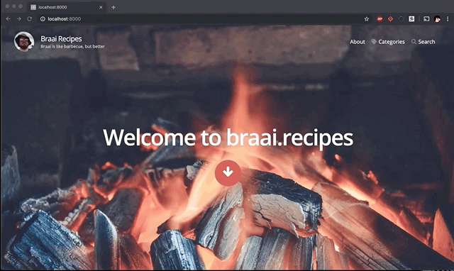

So I am really happy with the site right now but there are a couple of things that I need to improve. 

* Filter the Home Page
    * Only show "braai" or "recipe" category on the home page
* How I built this link
    * And a Link under the posts to "How I built this", a listing of my devlogs.
* Filtered Linking
    * When you are reading a post from one catergory only link to posts in the same category
* Custom Icon
    * Something temporary as Eva is going to make me a nice one :)

## Filter the Home Page

So to filter the homepage I just need to modify the GraphQL Query that is running on my index page (in `src/pages/index.js`)

```javascript
export const query = graphql`
  query IndexQuery {
    posts: allMarkdownRemark(
      filter: { fileAbsolutePath: { regex: "//posts/[0-9]+.*--/" }, frontmatter: { category: { in: ["braais","recipes"] } } }
      sort: { fields: [fields___prefix], order: DESC }
    ) {

```

What I have done there is added to my filter a filter on the frontmatter (fields in the yaml at the top of the Markdown files) to filter to the categories of "braai" and "recipes" only. Yes lots of use of the word filter. 



## How I built this link

I want all my devlogs to be viewable in one place so I need to add a new page, a link to it in the header and then have that new page just list the devlogs posts. 

I created a new page in `src/pages` for my devlogs page and simply copied the Post listing section on my index page making sure to filter to only devlogs

```javascript
import PropTypes from "prop-types";
import React from "react";
import { graphql } from "gatsby";
import { ThemeContext } from "../layouts";
import Blog from "../components/Blog";

class IndexPage extends React.Component {
  separator = React.createRef();

  scrollToContent = e => {
    this.separator.current.scrollIntoView({ block: "start", behavior: "smooth" });
  };

  render() {
    const {
      data: {
        posts: { edges: posts = [] },
      }
    } = this.props;

    return (
      <React.Fragment>

        <ThemeContext.Consumer>
          {theme => <Blog posts={posts} theme={theme} />}
        </ThemeContext.Consumer>

        <style jsx>{`
          hr {
            margin: 0;
            border: 0;
          }
        `}</style>
      </React.Fragment>
    );
  }
}

IndexPage.propTypes = {
  data: PropTypes.object.isRequired
};

export default IndexPage;

//eslint-disable-next-line no-undef
export const query = graphql`
  query DevlogsQuery {
    posts: allMarkdownRemark(
      filter: { fileAbsolutePath: { regex: "//posts/[0-9]+.*--/" }, frontmatter: { category: { in: ["devlogs"] } } }
      sort: { fields: [fields___slug], order: DESC }
    ) {
      edges {
        node {
          excerpt
          fields {
            slug
            prefix
          }
          frontmatter {
            title
            category
            author
            cover {
              children {
                ... on ImageSharp {
                  fluid(maxWidth: 800, maxHeight: 360) {
                    ...GatsbyImageSharpFluid_withWebp
                  }
                }
              }
            }
          }
        }
      }
    }
}
`;
```

All I needed to do then was to link to my new Page in the Menu component `src/components/Menu/Menu.js`

```javascript
this.items = [
  ...pages,
  { to: "/category/", label: "Categories", icon: FaTag },
  { to: "/devlogs/", label: "How I Built this", icon: GoTools},
  { to: "/search/", label: "Search", icon: FaSearch },
];
```

## Filtered Linking

At the moment on the site when I am reading the devlogs, or recipes I can see the next post may be something completely unrelated. It took a little bit of digging to figure this one out but it was actually really easy to fix. 

Each Post is written in markdown and turned in a Post via the Post component. This happens in the `gatsby-node.js` file's `createPages` function. Its also creating the different categories page so a quick change to that function and instead of creating all posts and having a link to the previous post, I can wrap that to create all posts by category and hence only link to posts in that category.

```javascript
 // Create posts
categoryList.forEach((category) => {
  const posts = items.filter(item => item.node.fields.source === "posts" && item.node.frontmatter.category === category);
  posts.forEach(({ node }, index) => {
    const slug = node.fields.slug;
    const next = index === 0 ? undefined : posts[index - 1].node;
    const prev = index === posts.length - 1 ? undefined : posts[index + 1].node;
    const source = node.fields.source;

    createPage({
      path: slug,
      component: postTemplate,
      context: {
        slug,
        prev,
        next,
        source
      }
    });
  });
});
```

## Custom Icon

So it turns out there is a script in `scripts/generate-app-icons.sh` that takes in icons in the `src/images/app-icons` and creates icons of different sizes from them. So I got a temporary icon on [pixabay](https://pixabay.com/) an generated some icons to use. 