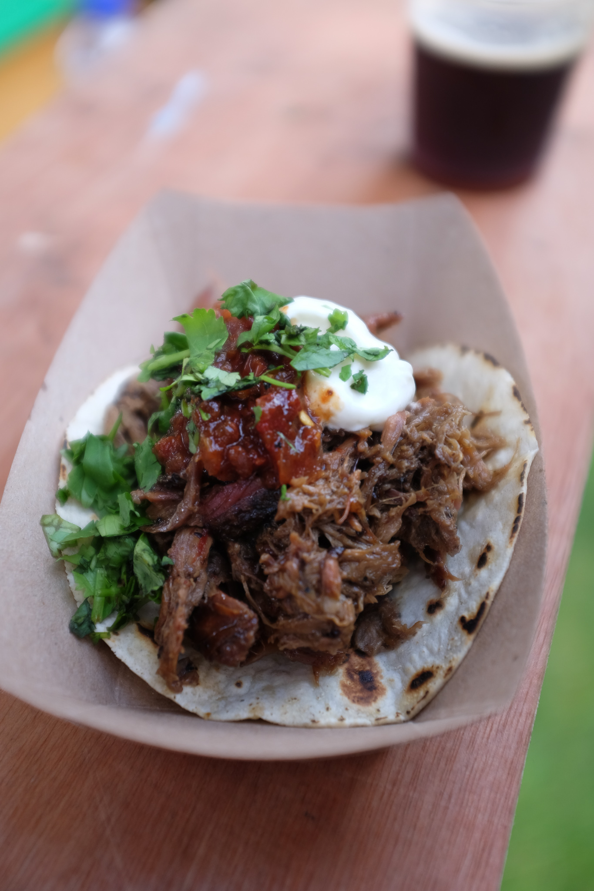
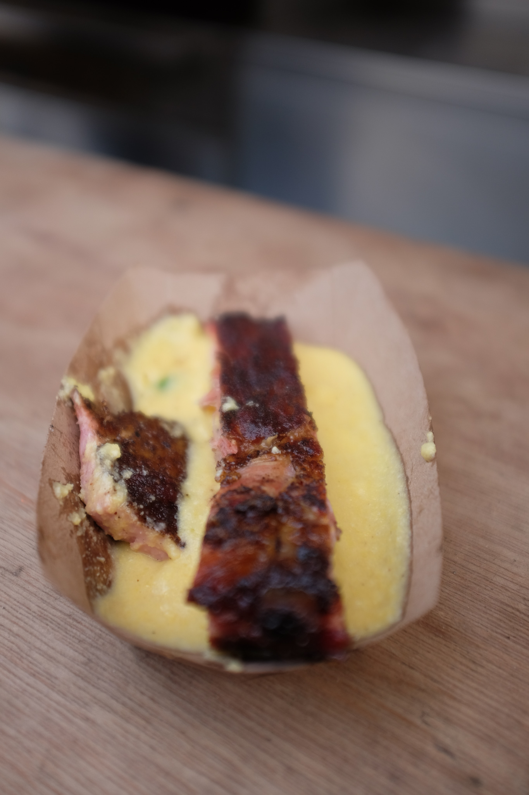
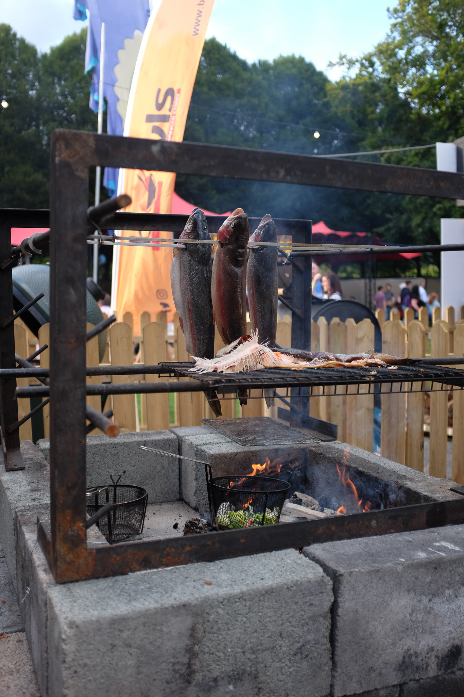
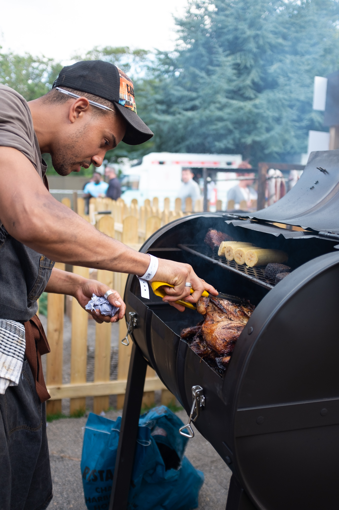
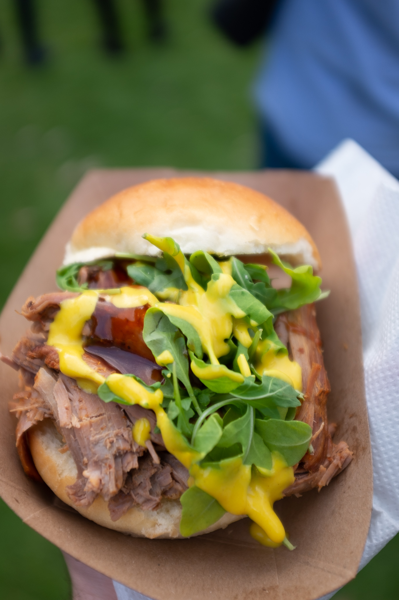

Today is the first day of the [Big Grill Festival](https://www.biggrillfestival.com/). Usually I never go because it falls on my birthday weekend and I am away. So I went after work to see what it was like and to perv on their braai's.

## Highlights - Lamb Tacos

The Lamb Barbacoa Taco with salsa roja and crema was my favourite dish. Made by Andy Low 'N' Slow, I need to try something similar at some stage.

You can follow him on [Twitter](https://twitter.com/andylownslow) and on [Instagram](https://www.instagram.com/andy_low_n_slow/)

## Highlights - St Louis Ribs with Cheddar Grits

Close second was the the St Louis Spare Ribs with Green Chilli and Irish Cheddar Grits by Mike Johnson from [Sugarfire Smoke House](https://sugarfiresmokehouse.com/).

I had never had Grits before and never had ribs like these. Really enjoyed it. The grits were amazing and the rib fell off the bone. Impressive grill as well!

Follow them on [Twitter](https://twitter.com/sugarfiresmoke) and [Instagram](https://www.instagram.com/sugarfiresmokehouse).

## Highlists - Nice Braais

I really enjoyed looking at what braai (grills) people where using. These 2 really caught my eye. 

## Overall opinion
Maybe I picked the wrong day but there were only a handful (10 maybe) of chefs cooking there with alot more craft beer stands and the usual folks at food festivals. Smaller than expected and pretty pricey. But I did enjoy looking at the braai's and eating the food though.

