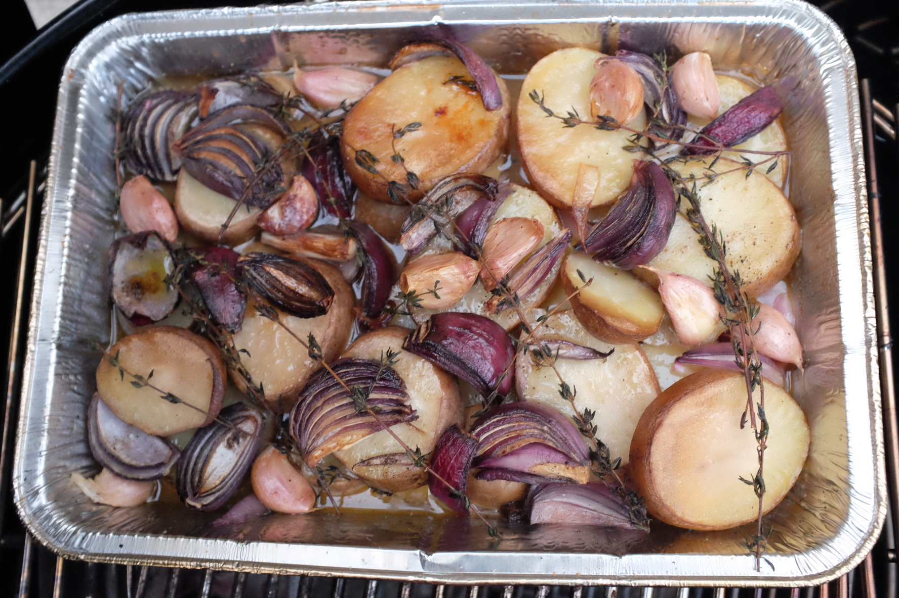

We are in lockdown here in Ireland and while I was picking up some essential
supplies I decided a Braai is essential! I had been eyeing up a recipe from [The Hairy
Bikers Mediterranean Adventure](https://www.bookdepository.com/The-Hairy-Bikers-Mediterranean-Adventure-TV-tie-in-Hairy-Bikers/9781409171911?redirected=true&utm_medium=Google&utm_campaign=Base1&utm_source=IE&utm_content=The-Hairy-Bikers-Mediterranean-Adventure-TV-tie-in&selectCurrency=EUR&w=AFFPAU96G7D6RMA8VCC9&pdg=pla-293946777986:cmp-9463711619:adg-98687126840:crv-420380901788:pos-:dev-c&gclid=EAIaIQobChMI9sX2-fq96AIVSLTtCh09XA_xEAQYASABEgKsGfD_BwE) cookbook for some time but it's usually done in an oven in a ceramic dish.

I decided I will try it on the Braai with some twists. Ingredients are hard to get at the moment so I improvised a bit!
I smoked it using Mesquite Chunks
and put the potatoes in a drip tray underneath.

## Corsican Lamb

**Ingredients:**

- 1.5 kg Lamb Shoulder
- 1kg of Potatoes (I used Maris Pipers), sliced about 5mm thick
- 2 Red onions, cut into eigths
- 1 garlic bulb split into cloves
- Thyme sprigs
- Lots of Olive oil
- 250ml White wine
- Salt and Pepper
- Mesquite wood chunks

## Method

**In the Kitchen**

1. Put the Potatoes, Onions, Garlic and Thyme into a tray (I used a foil drip tray but I think a thicker one would work better)
2. Drizzle generously with olive oil and mix.
3. Pour over the wine.
4. Rub the lamb with Salt and Pepper.

**At the Fire**

1. Heat up about 1/3 of a Chimney starter with coals.
2. Setup your coals off to one side (preferably somewhere you can add more coals to during the cook).
3. Place the Potatoes next to your coals underneath the spot your lamb will sit on the grid.
4. Place the Mesquite Chunks on the coals.

5. Place the lamb on the grid above the Potatoes and cook for 2.5-3 hours at ~ 150-200 celsuis.
6. You may need to top our your coals to maintain your heat.
7. Remove the Lamb and cover with foil leaving to stand for 20 mins.
8. Optionally pop the potatoes in the over at 200 celsuis if they look like they need crisping.

Serve and Enjoy :)

